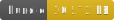

<h1 style="text-align: center;">
  <div align="center">Converter - To JSON</div>
</h1>

<p align="center">
  
  
  
</p>

## Description

Given an input of [Readers](../readers/reader.md), build (Geo|S2)JSON as an output file.

## Usage

### Regular JSON output

```ts
import { toJSON, JSONReader } from 'gis-tools-ts';
import { FileReader, FileWriter } from 'gis-tools-ts/file';
// or use mmap reader if using bun
// import { MMapReader } from 'gis-tools-ts/mmap';

const fileReader = new FileReader(`${__dirname}/fixtures/points.geojson`);
const jsonReader = new JSONReader(fileReader);
const bufWriter = new FileWriter(`${__dirname}/fixtures/points2.geojson`);

// store all the readers in a signle json file:
await toJSON(bufWriter, [jsonReader], { projection: 'WG', buildBBox: true });
```

### Line Delimited JSON output

```ts
import { toJSONLD, JSONReader } from 'gis-tools-ts';
import { FileReader, FileWriter } from 'gis-tools-ts/file';
// or use mmap reader if using bun
// import { MMapReader } from 'gis-tools-ts/mmap';

const fileReader = new FileReader(`${__dirname}/fixtures/points.geojson`);
const jsonReader = new JSONReader(fileReader);
const bufWriter = new FileWriter(`${__dirname}/fixtures/points.geojsonld`);
const onFeature = (feature) => {
 feature.metadata = { id: feature.id };
 return feature;
}

// store all the readers in a signle json file:
await toJSONLD(bufWriter, [jsonReader], { projection: 'S2', buildBBox: true, onFeature });
```

## Useful links

- <https://datatracker.ietf.org/doc/html/rfc8259>
- <https://en.wikipedia.org/wiki/JSON>
- <https://database.guide/what-is-ndjson/>
- <https://datatracker.ietf.org/doc/html/rfc7464>
- <https://datatracker.ietf.org/doc/html/rfc8142>
