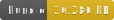
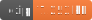

<h1 style="text-align: center;">
  <div align="center">Data Structure - Point Cluster</div>
</h1>

<p align="center">
  
  
  
</p>

## Description

Create a cluster tile system where points are quickly indexed at each zoom level. Querying the tile to render is fast and efficient.

## Usage

```ts
import { PointCluster } from 'gis-tools-ts';
import { FileVector } from 'gis-tools-ts/file';
import { MMapVector } from 'gis-tools-ts/mmap';
import type { ClusterOptions } from 'gis-tools-ts';

// create an index from stratch
const pointCluster = new PointCluster();
// OR specify options
const maxZoomStore = ...; // If the indexed data already exists you can re-input it here.
const options: ClusterOptions = {
  store: FileVector, // or MMapVector
  projection: 'WM', // Or 'S2' [Default: S2]
  layerName: 'default', // [Default: default]
  minzoom: 0, // [Default: 0]
  maxzoom: 5, // [Default: 16]
  radius: 10, // [Default: 40]
};
const pointCluster = new PointCluster(jsonInput, options, maxZoomStore);

// insert a lon-lat
pointCluster.insertLonLat(lon, lat, data);
// insert an STPoint
pointCluster.insertFaceST(face, s, t, data);
// insert a JSON feature, featureCollection, vector feature, etc.
pointCluster.insertFeature(json);

// Also, if you have any kind of reader class, you can import it directly
import { GeoTIFFReader } from 'gis-tools-ts';
const geotiffReader = new GeoTIFFReader(data);
pointCluster.insertReader(geotiffReader);

// after adding all the input data, build the clusters
await pointCluster.buildClusters();

// get the clusters for a tile
const tile = await pointCluster.getTile(id);
// or get the raw cluster data
const clusters = await pointCluster.getCellData(id);
```
