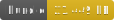

<h1 style="text-align: center;">
  <div align="center">Data Structure - Point Grid</div>
</h1>

<p align="center">
  
  
  
</p>

## Description

A cluster store to build grid data of gridSize x gridSize. The resultant tiles are filled. Useful for building raster tiles or other grid like data (temperature, precipitation, wind, etc).

Note on interpolation. I have found that  Inverse Distance Weight (IDW) interpolation has the best results at max zoom. As data is scaled up, the interpolator is changed to Lanczos. Especially for RGBA data, lanczos absolutely nails it.

You normally don't want to add a buffer to the Grid options as point data doesn't require it, but there are corner cases where you do want it. When working with wind data for example, you may want to animate wind particles on the GPU, and ass such it's good to know wind directions in neighboring cells. Having access to neighbors that extend out of the tile is important. Another example is terrain data where you may want to know the elevation of neighboring cells.

## Usage

```ts
import { PointGrid } from 'gis-tools-ts';
import { FileVector } from 'gis-tools-ts/file';
import { MMapVector } from 'gis-tools-ts/mmap';
import type { ClusterOptions } from 'gis-tools-ts';

// create an index from stratch
const pointCluster = new PointGrid();
// OR specify options
const maxZoomStore = ...; // If the indexed data already exists you can re-input it here.
const options: ClusterOptions = {
  store: FileVector, // or MMapVector
  projection: 'WM', // Or 'S2' [Default: S2]
  layerName: 'default', // [Default: default]
  minzoom: 0, // [Default: 0]
  maxzoom: 5, // [Default: 16]
  maxzoomInterpolation: 'idw', // the interpolator used at max zoom as input data is added [Default: 'idw']
  interpolation: 'lanczos', // interpolator used as tiles are scaled down zooms [Default: 'lanczos']
  // getting interpolation value is 'rgba' for RGBA data, but if you need to pull the value from the data point, you can specify a function to do so.
  getInterpolationValue: (point: VectorPoint<ElevationPoint>): number => point.m?.elev ?? 0,
  gridSize: 512, // [Default: 512]
  bufferSize: 0, // [Default: 0]
  nullValue: 0, // [Default: 0 or { r: 0, g: 0, b: 0, a: 0 } if getInterpolationValue is set to 'rgba']
};
const pointCluster = new PointGrid(jsonInput, options, maxZoomStore);

// insert a lon-lat
pointCluster.insertLonLat(lon, lat, data);
// insert an STPoint
pointCluster.insertFaceST(face, s, t, data);
// insert a JSON feature, featureCollection, vector feature, etc.
pointCluster.insertFeature(json);

// Also, if you have any kind of reader class, you can import it directly
import { GeoTIFFReader } from 'gis-tools-ts';
const geotiffReader = new GeoTIFFReader(data);
pointCluster.insertReader(geotiffReader);

// after adding all the input data, build the clusters
await pointCluster.buildClusters();

// get the clusters for a tile
const tile = await pointCluster.getTile(id);
```
