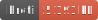

<h1 style="text-align: center;">
  <div align="center">Data Structure - Point Index</div>
</h1>

<p align="center">
  
  
  
</p>

## Description

An index of cells with radius/range queries.

## Usage

```ts
import { PointIndex } from 'gis-tools-ts';
import { FileVector } from 'gis-tools-ts/file';
import { MMapVector } from 'gis-tools-ts/mmap';

// indexer using an in-memory store
const pointIndex = new PointIndex();
// or used a filesystem based store
const pointIndex = new PointIndex(FileVector);
// or if you are using bun you can use a mmap based store
const pointIndex = new PointIndex(MMapVector);

// insert a lon-lat
pointIndex.insertLonLat(lon, lat, data);
// insert an STPoint
pointIndex.insertFaceST(face, s, t, data);
// insert a JSON feature, featureCollection, vector feature, etc.
pointIndex.insertFeature(json);

// Also, if you have any kind of reader class, you can import it directly
import { GeoTIFFReader } from 'gis-tools-ts';
const geotiffReader = new GeoTIFFReader(data);
pointIndex.insertReader(geotiffReader);

// after adding data build the index. NOTE: You don't have to call this, it will be called
// automatically when making a query
await pointIndex.sort();

// you can search a range
const points = await pointIndex.searchRange(low, high);
// or a radius
const points = await pointIndex.searchRadius(center, radius);
```
