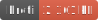

<h1 style="text-align: center;">
  <div align="center">Data Structure - Point Index Fast</div>
</h1>

<p align="center">
  
  
  
</p>

## Description

An index of cells with radius queries. Because of the nature of low level language like Javascript, using u64 (BigInt) is slow. This index uses f64 which Number supports while still working with Spherical coordinates. So it is fast and efficient.

## Usage

```ts
import { PointIndexFast } from 'gis-tools-ts';
import { KDMMapSpatialIndex } from 'gis-tools-ts/mmap';

const pointIndex = new PointIndexFast();
// Or used a mmap based store for local storage
const pointIndex = new PointIndex(KDMMapSpatialIndex);

// insert a lon-lat
pointIndex.insertLonLat(lon, lat, data);
// insert an STPoint
pointIndex.insertFaceST(face, s, t, data);

// after adding data build the index. NOTE: You don't have to call this, it will be called
// automatically when making a query
await pointIndex.sort();

// you can search a range
const points = await pointIndex.searchRange(minX, minY, maxX, maxY);
// or a standard radius search
const points = await pointIndex.searchRadius(qx, qy, r);
// or a spherical radius search that wraps around the -180/180 boundary
const points = await pointIndex.searchRadiusSphere(lon, lat, dist);
```
