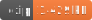

<h1 style="text-align: center;">
  <div align="center">NadGrid Reader</div>
</h1>

<p align="center">
  
  
  
</p>

## Description

Loads/reads a binary NTv2 file (.gsb)

Implements the [FeatureIterator](https://open-s2.github.io/gis-tools/interfaces/index.FeatureIterator.html) interface which means you can use it in a `for await` loop for all the resulting Vector Features.

## Usage

Be sure to checkout the [Reader](reader.md) page for more knowledge on how to input data into the NADGridReader.

### GIS Reader

```ts
import { NadGridReader } from 'gis-tools-ts'
import { FileReader } from 'gis-tools-ts/file';
// or use the MMapReader if using Bun:
// import { MMapReader } from 'gis-tools-ts/mmap';

const reader = new NadGridReader('BETA2007.gsb', new FileReader('./BETA2007.gsb'));

// access all the vector features
const data = await Array.fromAsync(reader);
```

### GridReader Store

This project includes a store that can be used to store and access grids from NTv2 files. This was used by Proj4 but may be useful outside it:

```ts
import { NadGridReader } from 'gis-tools-ts';
import { FileReader } from 'gis-tools-ts/file';
// Or use the MMapReader if using Bun:
// import { MMapReader } from 'gis-tools-ts/mmap';

const store = new NadGridStore();

// store a grid
store.addGridFromReader('BETA2007.gsb', new FileReader(`${__dirname}/fixtures/BETA2007.gsb`));

// get a grid
const grid = store.getGrid('BETA2007.gsb');

// get a grid given a list of names (comma separated):
const grids = store.getGridsFromString('BETA2007.gsb,TEST_A.gsb,TEST_B.gsb');
```

## Useful links

- <https://web.archive.org/web/20140127204822if_/http://www.mgs.gov.on.ca:80/stdprodconsume/groups/content/@mgs/@iandit/documents/resourcelist/stel02_047447.pdf>
- <http://mimaka.com/help/gs/html/004_NTV2%20Data%20Format.htm>
