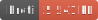

<h1 style="text-align: center;">
  <div align="center">NetCDF Reader</div>
</h1>

<p align="center">
  
  
  
</p>

## Description

Read the NetCDF v3.x file format. [See specification](https://www.unidata.ucar.edu/software/netcdf/docs/file_format_specifications.html) for more information.

Implements the [FeatureIterator](https://open-s2.github.io/gis-tools/interfaces/index.FeatureIterator.html) interface which means you can use it in a `for await` loop for all the resulting Vector Features.

## Usage

Be sure to checkout the [Reader](reader.md) page for more knowledge on how to input data into the NetCDFReader.

```ts
import { NetCDFReader } from 'gis-tools-ts';
import { FileReader } from 'gis-tools-ts/file';
// or use the MMapReader if using Bun:
// import { MMapReader } from 'gis-tools-ts/mmap';
import type { NetCDFReaderOptions } from 'gis-tools-ts';

// setup options if you want. Not required.
const options: NetCDFReaderOptions = {
  /** If provided the lookup of the longitude [Default='lon'] */
  lonKey: 'lon',
  /** If provided the lookup of the latitude [Default='lat'] */
  latKey: 'lat',
  /** If provided the lookup for the height value [Default=undefined] */
  heightKey: 'altitude',
  /** List of fields to include in the feature properties */
  propFields: ['prop1', 'prop2'],
};

const reader = new NetCDFReader(new FileReader('./data.nc'), options);

// Iterate over all the features
for (const feature of reader) {
  console.log(feature);
}
```

## Useful links

- <https://www.unidata.ucar.edu/software/netcdf/docs/file_format_specifications.html>
