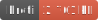

<h1 style="text-align: center;">
  <div align="center">Delaunator</div>
</h1>

<p align="center">
  
  
  
</p>

## Description

An incredibly fast and robust Typescript library for Delaunay triangulation of 2D points.

## Usage

```ts
import { Delaunator } from 'gis-tools-ts';
import type { Point, VectorPoint } from 'gis-tools-ts';

// its recommended to stereotypically use `fromPoints` to construct a Delaunator
const points: Point[] = [...];
const delaunator = Delaunator.fromPoints(points);

// or you can construct from vector points with `fromVectorPoints`
const points: VectorPoint[] = [...];
const delaunator = Delaunator.fromVectorPoints(points);

// you can now use the triangulation
const { triangles } = delaunator;
```

## Useful links

- <https://en.wikipedia.org/wiki/Delaunay_triangulation>
