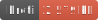

<h1 style="text-align: center;">
  <div align="center">Data Interpolation</div>
</h1>

<p align="center">
  
  
  
</p>

## Description

Interpolation is the process of filling in missing data in a dataset. This can be done in many different ways. Four common methods for GIS are average, nearest, inverse distance weighted, and lanczos.

Lanczos is the default method and arguably the most useful for interpolating RGBA spatial data.

The bilinear interpolation exists, but is not recommended as it can fail.

## Usage

### Acess any of the interpolators

```ts
import { getInterpolation, getRGBAInterpolation } from 'geo-tools-ts';

// get average interpolation
const average = getInterpolation('average');
// get nearest interpolation
const nearest = getInterpolation('nearest');
// get idw interpolation
const idw = getInterpolation('idw');
// get lanczos interpolation
const lanczos = getInterpolation('lanczos');
// get average interpolation

// RGBA

// get average interpolation
const rgbaAverage = getRGBAInterpolation('average');
// get nearest interpolation
const rgbaNearest = getRGBAInterpolation('nearest');
// get idw interpolation
const rgbaIDW = getRGBAInterpolation('idw');
// get lanczos interpolation
const rgbaLanczos = getRGBAInterpolation('lanczos');
```

### Average Neighbor Interpolation

![AvgInterp File Badge][averageInterpFileBadge] ![AvgInterp Gzip Badge][averageInterpGzipBadge] ![AvgInterp Brotli Badge][averageInterpBrotliBadge]

[averageInterpFileBadge]: ../../assets/badges/averageInterp-file.svg
[averageInterpGzipBadge]: ../../assets/badges/averageInterp-gzip.svg
[averageInterpBrotliBadge]: ../../assets/badges/averageInterp-brotli.svg

Finds the avarage point in the reference data to the given point and returns its value.

```ts
import { averageInterpolation, PointIndexFast } from 'gis-tools-ts';
import type { VectorPoint } from 'gis-tools-ts';

// We have m-value data that we want to interpolate
interface TempData { temp: number; }

const pointIndex = new PointIndexFast<TempData>();
// add lots of points
pointIndex.insertLonLat(lon, lat, data);

// given a point we are interested in
const point: VectorPoint = { x: 20, y: -40 };
//  get a collection of points relative to the point
const data = await pointIndex.searchRadius(point.x, point.y, radius);

// interpolate
const interpolatedValue: number = averageInterpolation<TempData>(point, data, (p) => p.m.temp);
```

If you want to process RGB(A) data, useHelper function.

```ts
import { rgbaAverageInterpolation } from 'gis-tools-ts';
import type { RGBA } from 'gis-tools-ts';

const interpolatedRGBAValue: RGBA = rgbaAverageInterpolation(point, data);
```

### Nearest Neighbor Interpolation

![NearInterp File Badge][nearestInterpFileBadge] ![NearInterp Gzip Badge][nearestInterpGzipBadge] ![NearInterp Brotli Badge][nearestInterpBrotliBadge]

[nearestInterpFileBadge]: ../../assets/badges/nearestInterp-file.svg
[nearestInterpGzipBadge]: ../../assets/badges/nearestInterp-gzip.svg
[nearestInterpBrotliBadge]: ../../assets/badges/nearestInterp-brotli.svg

Finds the nearest point in the reference data to the given point and returns its value.

```ts
import { nearestInterpolation, PointIndexFast } from 'gis-tools-ts';
import type { VectorPoint } from 'gis-tools-ts';

// We have m-value data that we want to interpolate
interface TempData { temp: number; }

const pointIndex = new PointIndexFast<TempData>();
// add lots of points
pointIndex.insertLonLat(lon, lat, data);
// ....

// given a point we are interested in
const point: VectorPoint = { x: 20, y: -40 };
//  get a collection of points relative to the point
const data = await pointIndex.searchRadius(point.x, point.y, radius);

// interpolate
const interpolatedValue = nearestInterpolation<TempData>(point, data, (p) => p.m.temp);
```

If you want to process RGB(A) data, useHelper function.

```ts
import { rgbaNearestInterpolation } from 'gis-tools-ts';
import type { RGBA } from 'gis-tools-ts';

const interpolatedRGBAValue: RGBA = rgbaNearestInterpolation(point, data);
```

### Inverse Distance Weighting Interpolation

![IDWInterp File Badge][idwInterpFileBadge] ![IDWInterp Gzip Badge][idwInterpGzipBadge] ![IDWInterp Brotli Badge][idwInterpBrotliBadge]

[idwInterpFileBadge]: ../../assets/badges/idwInterp-file.svg
[idwInterpGzipBadge]: ../../assets/badges/idwInterp-gzip.svg
[idwInterpBrotliBadge]: ../../assets/badges/idwInterp-brotli.svg

Given a reference of data, interpolate a point using inverse distance weighting

```ts
import { idwInterpolation, PointIndexFast } from 'gis-tools-ts';
import type { VectorPoint } from 'gis-tools-ts';

// We have m-value data that we want to interpolate
interface TempData { temp: number; }

const pointIndex = new PointIndexFast<TempData>();
// add lots of points
pointIndex.insertLonLat(lon, lat, data);
// ....

// given a point we are interested in
const point: VectorPoint = { x: 20, y: -40 };
//  get a collection of points relative to the point
const data = await pointIndex.searchRadius(point.x, point.y, radius);

// interpolate
const interpolatedValue = idwInterpolation<TempData>(point, data, (p) => p.m.temp);
```

If you want to process RGB(A) data, useHelper function.

```ts
import { rgbaIDWInterpolation } from 'gis-tools-ts';
import type { RGBA } from 'gis-tools-ts';

const interpolatedRGBAValue: RGBA = rgbaIDWInterpolation(point, data);
```

### Lanczos Interpolation

![LancInterp File Badge][lanczosInterpFileBadge] ![LancInterp Gzip Badge][lanczosInterpGzipBadge] ![LancInterp Brotli Badge][lanczosInterpBrotliBadge]

[lanczosInterpFileBadge]: ../../assets/badges/lanczosInterp-file.svg
[lanczosInterpGzipBadge]: ../../assets/badges/lanczosInterp-gzip.svg
[lanczosInterpBrotliBadge]: ../../assets/badges/lanczosInterp-brotli.svg

Perform interpolation using the Lanczos filter. This method uses a kernel-based approach to weigh contributions from nearby points, providing a balance between smoothing and sharpness.

```ts
import { lanczosInterpolation, PointIndexFast } from 'gis-tools-ts';
import type { VectorPoint } from 'gis-tools-ts';

// We have m-value data that we want to interpolate
interface TempData { temp: number; }

const pointIndex = new PointIndexFast<TempData>();
// add lots of points
pointIndex.insertLonLat(lon, lat, data);
// ....

// given a point we are interested in
const point: VectorPoint = { x: 20, y: -40 };
//  get a collection of points relative to the point
const data = await pointIndex.searchRadius(point.x, point.y, radius);

// interpolate
const interpolatedValue = lanczosInterpolation<TempData>(point, data, (p) => p.m.temp);
```

If you want to process RGB(A) data, useHelper function.

```ts
import { rgbaLanczosInterpolation } from 'gis-tools-ts';
import type { RGBA } from 'gis-tools-ts';

const interpolatedRGBAValue: RGBA = rgbaLanczosInterpolation(point, data);
```

## Useful links

- <https://en.wikipedia.org/wiki/Lanczos_algorithm>
- <https://en.wikipedia.org/wiki/Inverse_distance_weighting>
- <https://pro.arcgis.com/en/pro-app/latest/help/analysis/geostatistical-analyst/how-inverse-distance-weighted-interpolation-works.htm>
