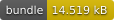
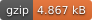
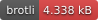

<h1 style="text-align: center;">
  <div align="center">GPX Writer</div>
</h1>

<p align="center">
  
  
  
</p>

## Description

Given a writer and an array of iterators, write the input features to the writer as a GPX data

## Usage

### Browser Compatible

```ts
import { BufferWriter, BufferJSONReader, toGPX } from 'gis-tools-ts';

// Given a FeatureCollection object, setup the reader.
const jsonReader = new BufferJSONReader({ ... });
// setup a buffer output
const bufWriter = new BufferWriter();

// write as GPX data to the writer.
await toGPX(bufWriter, [jsonReader]);

// for fun let's get the string output
const csvString = new TextDecoder().decode(bufWriter.commit());
```

### Node/Deno/Bun using the filesystem

Instead of the BufferWriter, you can utilize the FileWriter and FileReader

```ts
import { JSONReader } from 'gis-tools-ts';
import { FileReader, FileWriter } from 'gis-tools-ts/file';

// setup file reading input
const jsonReader = new JSONReader(new FileReader(`./points.geojson`));
// setup file output
const fileWriter = new FileWriter('./output.csv');

// SAME AS ABOVE
```

## Useful links

- <https://www.topografix.com/gpx.asp>
